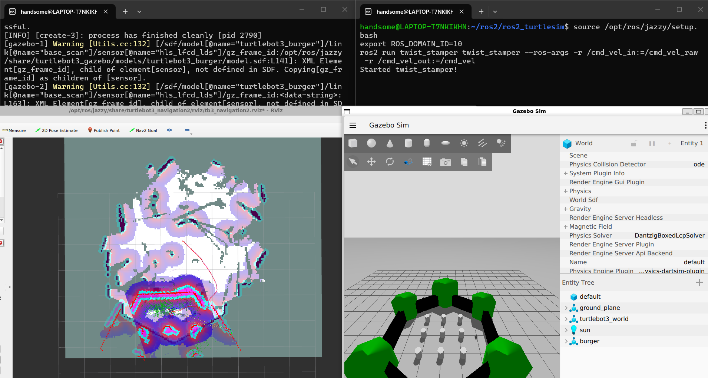

# ROS2 — Turtlesim, Gazebo, SLAM & Nav2

A ROS2 learning project covering turtlesim control, TurtleBot3 in Gazebo, SLAM map building with Cartographer, and autonomous navigation with Nav2.



## Packages

### `my_robot_interfaces`

**Action:** `NavigatePath`
- **Goal:** `geometry_msgs/Pose[] waypoints`, `float32 linear_speed`, `float32 angular_speed`, `float32 waypoint_timeout`, `bool resume`
- **Result:** `bool success`, `string message`, `uint32 waypoints_completed`
- **Feedback:** `uint32 current_index`, `uint32 total_waypoints`, `float32 remaining_distance`, `float32 current_x`, `float32 current_y`

**Service:** `SetSpeed`
- **Request:** `float32 linear_speed`, `float32 angular_speed`
- **Response:** `bool success`, `string message`

### `my_turtle_controllers`

**Node:** `draw_circle_node`
- Publishes circular motion to `/<turtle_name>/cmd_vel`
- Subscribes to `/<turtle_name>/pose` for current position
- Exposes `/<turtle_name>/navigate_path` action server with proportional control navigation
- Exposes `/<turtle_name>/set_speed` service to change circle speed at runtime
- Uses `MultiThreadedExecutor` so pose callbacks keep firing during action execution
- Supports `turtle_name` parameter for running multiple instances

---

## Setup (Ubuntu 24.04 / WSL) — First Time

Follow these steps in order. Do this once on a fresh machine.

### Step 1 — Install ROS2 Jazzy

```bash
sudo apt update && sudo apt install -y curl gnupg lsb-release
sudo curl -sSL https://raw.githubusercontent.com/ros/rosdistro/master/ros.key \
  | sudo tee /usr/share/keyrings/ros-archive-keyring.gpg > /dev/null
echo "deb [arch=$(dpkg --print-architecture) signed-by=/usr/share/keyrings/ros-archive-keyring.gpg] \
  http://packages.ros.org/ros2/ubuntu noble main" \
  | sudo tee /etc/apt/sources.list.d/ros2.list
sudo apt update
sudo apt install -y ros-jazzy-desktop python3-colcon-common-extensions
```

### Step 2 — Source ROS2 permanently

```bash
echo "source /opt/ros/jazzy/setup.bash" >> ~/.bashrc
source ~/.bashrc
```

### Step 3 — Install Gazebo Harmonic

```bash
sudo curl -sSL https://packages.osrfoundation.org/gazebo.gpg \
  | sudo tee /usr/share/keyrings/pkgs-osrf-archive-keyring.gpg > /dev/null
echo "deb [arch=$(dpkg --print-architecture) signed-by=/usr/share/keyrings/pkgs-osrf-archive-keyring.gpg] \
  http://packages.osrfoundation.org/gazebo/ubuntu-stable noble main" \
  | sudo tee /etc/apt/sources.list.d/gazebo-stable.list
sudo apt update && sudo apt install -y gz-harmonic
```

### Step 4 — Install TurtleBot3 and simulation packages

```bash
sudo apt install -y \
  ros-jazzy-ros-gz \
  ros-jazzy-turtlebot3 \
  ros-jazzy-turtlebot3-simulations \
  ros-jazzy-nav2-bringup \
  ros-jazzy-slam-toolbox \
  ros-jazzy-turtlebot3-cartographer \
  ros-jazzy-turtlebot3-navigation2 \
  ros-jazzy-twist-stamper \
  ros-jazzy-teleop-twist-keyboard
```

### Step 5 — Set TurtleBot3 model and domain ID permanently

```bash
echo "export TURTLEBOT3_MODEL=burger" >> ~/.bashrc
echo "export ROS_DOMAIN_ID=10" >> ~/.bashrc
source ~/.bashrc
```

> **Why `ROS_DOMAIN_ID=10`?** The default domain (0) can receive cached DDS messages from previous Gazebo sessions, causing TF errors and phantom robot movement. Domain 10 avoids this.

### Step 6 — Clone and build this project

```bash
mkdir -p ~/ros2 && cd ~/ros2
git clone https://github.com/sannyuntwin/ros2_turtlesim.git
cd ros2_turtlesim
colcon build
echo "source ~/ros2/ros2_turtlesim/install/setup.bash" >> ~/.bashrc
source ~/.bashrc
```

> After this, every new terminal is ready to use — no need to source manually.

---

## Run

> **Important:** Start terminals in this order. Each terminal must source the workspace first.

**Terminal 1 — turtlesim:**
```bash
source ~/ros2/ros2_turtlesim/install/setup.bash
ros2 run turtlesim turtlesim_node
```

**Terminal 2 — draw_circle node:**
```bash
source ~/ros2/ros2_turtlesim/install/setup.bash
ros2 run my_turtle_controllers draw_circle
```
The node logs `Draw circle node ready for [turtle1].` and then runs silently while drawing circles.

**Terminal 3 — send a navigation goal:**
```bash
source ~/ros2/ros2_turtlesim/install/setup.bash
ros2 action send_goal --feedback /turtle1/navigate_path my_robot_interfaces/action/NavigatePath \
  "{waypoints: [{position: {x: 5.0, y: 8.0, z: 0.0}, orientation: {w: 1.0}},
                {position: {x: 2.0, y: 2.0, z: 0.0}, orientation: {w: 1.0}}],
    linear_speed: 2.0, angular_speed: 0.0, waypoint_timeout: 30.0, resume: false}"
```

---

## Testing Each Feature

> Before testing any feature: Terminal 1 (turtlesim) and Terminal 2 (draw_circle) must already be running.

### Test Feature 1 — Pose feedback
Send a goal with `--feedback`. Watch live position updates print in Terminal 3:
```bash
source ~/ros2/ros2_turtlesim/install/setup.bash
ros2 action send_goal --feedback /turtle1/navigate_path my_robot_interfaces/action/NavigatePath \
  "{waypoints: [{position: {x: 5.0, y: 8.0, z: 0.0}, orientation: {w: 1.0}}],
    linear_speed: 2.0, angular_speed: 0.0, waypoint_timeout: 30.0, resume: false}"
```
**Expected:** Feedback lines showing `current_x`, `current_y`, `remaining_distance` updating every 0.1s.

---

### Test Feature 2 — Cancel and resume
**Step 1** — Send a 5-waypoint goal at slow speed:
```bash
source ~/ros2/ros2_turtlesim/install/setup.bash
ros2 action send_goal --feedback /turtle1/navigate_path my_robot_interfaces/action/NavigatePath \
  "{waypoints: [
      {position: {x: 1.0, y: 1.0, z: 0.0}, orientation: {w: 1.0}},
      {position: {x: 9.0, y: 1.0, z: 0.0}, orientation: {w: 1.0}},
      {position: {x: 9.0, y: 9.0, z: 0.0}, orientation: {w: 1.0}},
      {position: {x: 1.0, y: 9.0, z: 0.0}, orientation: {w: 1.0}},
      {position: {x: 5.0, y: 5.0, z: 0.0}, orientation: {w: 1.0}}],
    linear_speed: 1.0, angular_speed: 0.0, waypoint_timeout: 60.0, resume: false}"
```
**Step 2** — While turtle is moving, press `Ctrl+C`.
**Expected in Terminal 2:** `Cancelled at waypoint X. Send goal with resume=true to continue.`

**Step 3** — Resume from the cancelled waypoint:
```bash
ros2 action send_goal --feedback /turtle1/navigate_path my_robot_interfaces/action/NavigatePath \
  "{waypoints: [], linear_speed: 0.0, angular_speed: 0.0, waypoint_timeout: 0.0, resume: true}"
```
**Expected:** Turtle continues from the waypoint it was heading to, not from the beginning.

---

### Test Feature 3 — Speed parameter in goal
Send the same goal twice with different speeds:
```bash
# Slow
ros2 action send_goal --feedback /turtle1/navigate_path my_robot_interfaces/action/NavigatePath \
  "{waypoints: [{position: {x: 8.0, y: 8.0, z: 0.0}, orientation: {w: 1.0}}],
    linear_speed: 0.5, angular_speed: 0.0, waypoint_timeout: 30.0, resume: false}"
# Fast
ros2 action send_goal --feedback /turtle1/navigate_path my_robot_interfaces/action/NavigatePath \
  "{waypoints: [{position: {x: 2.0, y: 2.0, z: 0.0}, orientation: {w: 1.0}}],
    linear_speed: 5.0, angular_speed: 0.0, waypoint_timeout: 30.0, resume: false}"
```
**Expected:** Turtle visibly moves faster for the second goal.

---

### Test Feature 4 — Waypoint timeout
Set a very short timeout (2 seconds) for a far waypoint:
```bash
ros2 action send_goal --feedback /turtle1/navigate_path my_robot_interfaces/action/NavigatePath \
  "{waypoints: [
      {position: {x: 9.0, y: 9.0, z: 0.0}, orientation: {w: 1.0}},
      {position: {x: 5.0, y: 5.0, z: 0.0}, orientation: {w: 1.0}}],
    linear_speed: 1.0, angular_speed: 0.0, waypoint_timeout: 2.0, resume: false}"
```
**Expected in Terminal 2:** `Waypoint 1 timed out — skipping.` then turtle moves to waypoint 2.

---

### Test Feature 5 — Change circle speed at runtime
While turtle is circling (Terminal 2 running, no active goal), open a new terminal:
```bash
source ~/ros2/ros2_turtlesim/install/setup.bash
# Slow it down
ros2 service call /turtle1/set_speed my_robot_interfaces/srv/SetSpeed \
  "{linear_speed: 0.3, angular_speed: 0.3}"
# Speed it up
ros2 service call /turtle1/set_speed my_robot_interfaces/srv/SetSpeed \
  "{linear_speed: 4.0, angular_speed: 4.0}"
```
**Expected:** Circle radius and speed change immediately in the turtlesim window.

---

### Test Feature 6 — Multiple turtles
Stop Terminal 1 and Terminal 2 (Ctrl+C both). Then use the launch file instead:
```bash
source ~/ros2/ros2_turtlesim/install/setup.bash
ros2 launch my_turtle_controllers multi_turtle.launch.py
```
**Expected:** Two turtles appear and both draw circles. Send goals to each independently:
```bash
# Terminal A — navigate turtle1
ros2 action send_goal --feedback /turtle1/navigate_path my_robot_interfaces/action/NavigatePath \
  "{waypoints: [{position: {x: 2.0, y: 8.0, z: 0.0}, orientation: {w: 1.0}}],
    linear_speed: 2.0, angular_speed: 0.0, waypoint_timeout: 30.0, resume: false}"
# Terminal B — navigate turtle2 at the same time
ros2 action send_goal --feedback /turtle2/navigate_path my_robot_interfaces/action/NavigatePath \
  "{waypoints: [{position: {x: 8.0, y: 2.0, z: 0.0}, orientation: {w: 1.0}}],
    linear_speed: 2.0, angular_speed: 0.0, waypoint_timeout: 30.0, resume: false}"
```

---

## Features

### 1. Pose feedback
The action client receives `current_x` and `current_y` in every feedback message.

### 2. Cancel and resume

**Step 1** — Send a goal with many waypoints (use slow speed so there's time to cancel):
```bash
ros2 action send_goal --feedback /turtle1/navigate_path my_robot_interfaces/action/NavigatePath \
  "{waypoints: [
      {position: {x: 1.0, y: 1.0, z: 0.0}, orientation: {w: 1.0}},
      {position: {x: 9.0, y: 1.0, z: 0.0}, orientation: {w: 1.0}},
      {position: {x: 9.0, y: 9.0, z: 0.0}, orientation: {w: 1.0}},
      {position: {x: 1.0, y: 9.0, z: 0.0}, orientation: {w: 1.0}},
      {position: {x: 5.0, y: 5.0, z: 0.0}, orientation: {w: 1.0}}],
    linear_speed: 1.0, angular_speed: 0.0, waypoint_timeout: 60.0, resume: false}"
```

**Step 2** — While the turtle is moving, press `Ctrl+C`. Terminal 2 should log `Cancelled at waypoint X`.

**Step 3** — Resume from where it stopped:
```bash
ros2 action send_goal --feedback /turtle1/navigate_path my_robot_interfaces/action/NavigatePath \
  "{waypoints: [], linear_speed: 0.0, angular_speed: 0.0, waypoint_timeout: 0.0, resume: true}"
```

### 3. Speed parameter in goal
Set `linear_speed` in the goal (0.0 uses the node default):
```bash
"{..., linear_speed: 3.0, ...}"
```

### 4. Waypoint timeout
If the turtle cannot reach a waypoint within the timeout (seconds), it skips and continues:
```bash
"{..., waypoint_timeout: 5.0, ...}"
```

### 5. Change circle speed at runtime

While the turtle is circling (no active goal), call from a new terminal:
```bash
source ~/ros2/ros2_turtlesim/install/setup.bash
ros2 service call /turtle1/set_speed my_robot_interfaces/srv/SetSpeed \
  "{linear_speed: 0.3, angular_speed: 0.3}"
```

### 6. Multiple turtles

Instead of running Terminal 1 + Terminal 2 separately, use the launch file:
```bash
source ~/ros2/ros2_turtlesim/install/setup.bash
ros2 launch my_turtle_controllers multi_turtle.launch.py
```
This starts turtlesim and two draw_circle nodes (turtle1 and turtle2). Send goals independently:
```bash
ros2 action send_goal --feedback /turtle2/navigate_path my_robot_interfaces/action/NavigatePath \
  "{waypoints: [{position: {x: 3.0, y: 7.0, z: 0.0}, orientation: {w: 1.0}}],
    linear_speed: 1.5, angular_speed: 0.0, waypoint_timeout: 30.0, resume: false}"
```

---

## Gazebo (TurtleBot3)

Run the same navigation features on a real physics simulation using TurtleBot3 in Gazebo.

### Setup

```bash
# Install Gazebo Harmonic
sudo curl -sSL https://packages.osrfoundation.org/gazebo.gpg | sudo tee /usr/share/keyrings/pkgs-osrf-archive-keyring.gpg > /dev/null
echo "deb [arch=$(dpkg --print-architecture) signed-by=/usr/share/keyrings/pkgs-osrf-archive-keyring.gpg] http://packages.osrfoundation.org/gazebo/ubuntu-stable noble main" | sudo tee /etc/apt/sources.list.d/gazebo-stable.list
sudo apt update && sudo apt install -y gz-harmonic

# Install TurtleBot3 packages
sudo apt install -y ros-jazzy-ros-gz ros-jazzy-turtlebot3 ros-jazzy-turtlebot3-simulations

# Set robot model permanently
echo "export TURTLEBOT3_MODEL=burger" >> ~/.bashrc
source ~/.bashrc
```

### Run

**Terminal 1 — launch Gazebo with TurtleBot3:**
```bash
TURTLEBOT3_MODEL=burger ros2 launch turtlebot3_gazebo turtlebot3_world.launch.py
```

**Terminal 2 — run the Gazebo draw_circle node:**
```bash
ros2 run my_turtle_controllers draw_circle_gazebo
```
The robot starts circling in Gazebo automatically.

**Terminal 3 — send a navigation goal:**
```bash
ros2 action send_goal --feedback /navigate_path my_robot_interfaces/action/NavigatePath \
  "{waypoints: [{position: {x: 1.0, y: 0.5, z: 0.0}, orientation: {w: 1.0}},
                {position: {x: 0.0, y: 0.0, z: 0.0}, orientation: {w: 1.0}}],
    linear_speed: 0.2, angular_speed: 0.0, waypoint_timeout: 30.0, resume: false}"
```

### Key differences from turtlesim

| | turtlesim | Gazebo / TurtleBot3 |
|--|-----------|---------------------|
| cmd_vel type | `Twist` | `TwistStamped` |
| Position source | `turtlesim/Pose` on `/<name>/pose` | `nav_msgs/Odometry` on `/odom` |
| Action topic | `/<name>/navigate_path` | `/navigate_path` |
| Service topic | `/<name>/set_speed` | `/set_speed` |
| Default speed | 2.0 m/s | 0.2 m/s (real robot limit) |
| Coordinate space | 0–11 units | meters from origin |

### Change circle speed at runtime (Gazebo)
```bash
ros2 service call /set_speed my_robot_interfaces/srv/SetSpeed \
  "{linear_speed: 0.1, angular_speed: 0.3}"
```

---

## SLAM — Build a Map (Gazebo)

SLAM lets the robot build a map of its environment by driving around. You need this map before using Nav2.

### Additional install

```bash
sudo apt install -y \
  ros-jazzy-nav2-bringup \
  ros-jazzy-slam-toolbox \
  ros-jazzy-turtlebot3-cartographer \
  ros-jazzy-turtlebot3-navigation2 \
  ros-jazzy-twist-stamper
```

### Run SLAM (4 terminals)

**Terminal 1 — Gazebo:**
```bash
source /opt/ros/jazzy/setup.bash
export TURTLEBOT3_MODEL=burger
export ROS_DOMAIN_ID=10
ros2 launch turtlebot3_gazebo turtlebot3_world.launch.py
```

**Terminal 2 — SLAM (opens RViz2 with live map):**
```bash
source /opt/ros/jazzy/setup.bash
export TURTLEBOT3_MODEL=burger
export ROS_DOMAIN_ID=10
ros2 launch turtlebot3_cartographer cartographer.launch.py use_sim_time:=True
```

**Terminal 3 — Twist converter** (Gazebo needs `TwistStamped`, teleop sends `Twist`):
```bash
source /opt/ros/jazzy/setup.bash
export ROS_DOMAIN_ID=10
ros2 run twist_stamper twist_stamper --ros-args \
  -r /cmd_vel_in:=/cmd_vel_raw \
  -r /cmd_vel_out:=/cmd_vel
```

**Terminal 4 — Teleop keyboard:**
```bash
source /opt/ros/jazzy/setup.bash
export ROS_DOMAIN_ID=10
ros2 run teleop_twist_keyboard teleop_twist_keyboard --ros-args -r /cmd_vel:=/cmd_vel_raw
```

> **Important:** Click on Terminal 4 to give it keyboard focus before pressing keys.
> **Speed tip:** Default speed is 0.50 m/s — too fast for the walls. Press `x` to reduce speed before driving. Press it about 16 times to reach ~0.10 m/s, which is safe for the world boundaries.

Teleop keys:
| Key | Action |
|-----|--------|
| `i` | Forward |
| `,` | Backward |
| `j` | Rotate left |
| `l` | Rotate right |
| `k` | Stop |
| `x` / `w` | Decrease / increase linear speed |
| `q` / `z` | Increase / decrease max speed |

Drive around all walls of the world. Watch RViz2 — the map fills in as the LiDAR scans.

### Save the map

When the map looks complete, open a new terminal and save it:
```bash
source /opt/ros/jazzy/setup.bash
ros2 run nav2_map_server map_saver_cli -f ~/map
```
This creates `~/map.pgm` and `~/map.yaml`.

---

## Nav2 — Autonomous Navigation (Gazebo)

Nav2 uses the saved map to plan paths and avoid obstacles automatically.

### Run Nav2 (3 terminals)

**Terminal 1 — Gazebo:**
```bash
source /opt/ros/jazzy/setup.bash
export TURTLEBOT3_MODEL=burger
export ROS_DOMAIN_ID=10
ros2 launch turtlebot3_gazebo turtlebot3_world.launch.py
```

**Terminal 2 — Nav2 with saved map:**
```bash
source /opt/ros/jazzy/setup.bash
export TURTLEBOT3_MODEL=burger
export ROS_DOMAIN_ID=10
ros2 launch turtlebot3_navigation2 navigation2.launch.py \
  use_sim_time:=True map:=$HOME/map.yaml
```
This opens RViz2 with the map loaded.

**Terminal 3 — Set initial pose in RViz2:**

In RViz2:
1. Click **"2D Pose Estimate"** button (top toolbar)
2. Click where the robot is on the map and drag to set its direction
3. The robot's position is now known to Nav2

**Send a navigation goal:**

In RViz2:
1. Click **"Nav2 Goal"** button (top toolbar)
2. Click any point on the map
3. The robot plans a path and drives there automatically — avoiding obstacles

### Clean RViz2 display (optional)

The default Nav2 RViz config is busy. A cleaner config is included at `rviz/nav2_clean.rviz`.
Copy it to WSL and load it in RViz2:

```bash
cp /mnt/d/ros2_ws/rviz/nav2_clean.rviz ~/nav2_clean.rviz
```

Then in RViz2: **File → Open Config → `~/nav2_clean.rviz`**

Changes: TF arrows hidden, particle cloud hidden, costmap alpha reduced, laser scan shown as clean green dots.

### What Nav2 adds over your custom node

| Your node | Nav2 |
|-----------|------|
| Proportional control (drives straight to goal) | A* / Dijkstra path planning |
| No obstacle awareness | Costmaps — avoids walls and objects |
| Fixed waypoints | Dynamic replanning if path is blocked |
| Custom action server | Standard `NavigateToPose` action |

---

## Troubleshooting

### TF_OLD_DATA warnings / robot moves on its own at startup

**Symptom:** RViz2 shows nothing, or the robot moves in Gazebo with no publishers on `/cmd_vel`.

**Cause:** DDS middleware caches TF messages from a previous Gazebo session. When Gazebo restarts, old cached messages are still delivered.

**Fix:** Restart WSL completely (run in PowerShell on Windows):
```powershell
wsl --shutdown
```
Then reopen all terminals. This clears the DDS cache.

### Topics not visible between terminals / robot not responding to teleop

**Symptom:** `/cmd_vel_raw` not visible from another terminal, `echo $ROS_DOMAIN_ID` returns empty.

**Cause:** Different terminals are on different DDS domains (some on 0, some on 10).

**Fix:** Add `ROS_DOMAIN_ID=10` permanently:
```bash
echo "export ROS_DOMAIN_ID=10" >> ~/.bashrc
source ~/.bashrc
```
Every terminal must use the same domain ID.

### Teleop speed dropped to 0.00

**Cause:** Pressing `x` too many times reduces the speed multiplier to zero.

**Fix:** Ctrl+C and restart teleop (resets to 0.50 m/s default). Then press `x` exactly 16 times to reach ~0.10 m/s.

### Robot escapes the walls in Gazebo

**Cause:** Default teleop speed (0.50 m/s) is too high. Gazebo Harmonic wall collisions can fail at high speed.

**Fix:** Reduce speed to 0.10 m/s before driving (press `x` 16 times from default).
